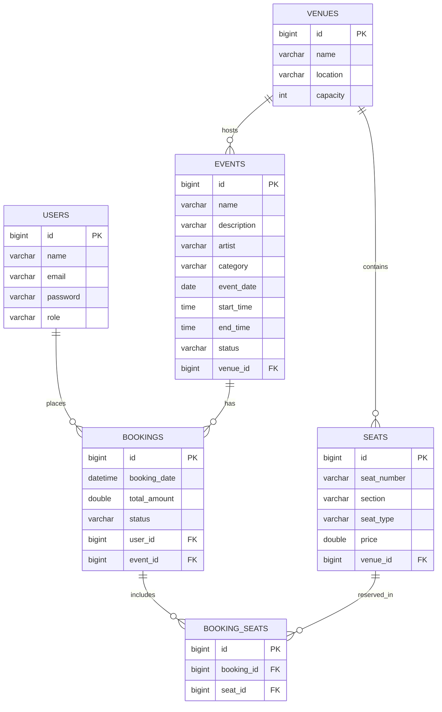
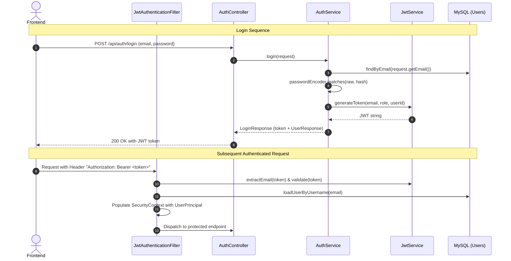

# EVENTRA — Backend Architecture & Design Document

This document provides a technical deep-dive into the architectural patterns, security model, data flow, and error-handling mechanisms implemented in the EVENTRA Spring Boot backend.

---

## Table of Contents
1. [Layered Architecture (Controller → Service → Repository)](#1-layered-architecture)
2. [Domain Entities & JPA Relationships](#2-domain-entities--jpa-relationships)
3. [JWT Authentication Flow](#3-jwt-authentication-flow)
4. [BCrypt Password Security Flow](#4-bcrypt-password-security-flow)
5. [Role-Based Access Control (USER vs ADMIN)](#5-role-based-access-control)
6. [Service-Layer Ownership & IDOR Protection](#6-service-layer-ownership--idor-protection)
7. [Booking Transaction & Double-Booking Protection](#7-booking-transaction--double-booking-protection)
8. [Global Exception Handling & Error Architecture](#8-global-exception-handling--error-architecture)
9. [CORS Configuration for React SPA](#9-cors-configuration-for-react-spa)

---

## 1. Layered Architecture

EVENTRA is structured strictly according to the classic enterprise layered pattern to guarantee separation of concerns:

```
┌────────────────────────────────────────────────────────┐
│                   HTTP / REST Clients                  │
│                     (React Frontend)                   │
└───────────────────────────┬────────────────────────────┘
                            │
                            ▼
┌────────────────────────────────────────────────────────┐
│                   Security Layer                       │
│  - JwtAuthenticationFilter (Token verification)        │
│  - CustomAuthenticationEntryPoint (401 Handler)        │
│  - CustomAccessDeniedHandler (403 Handler)             │
└───────────────────────────┬────────────────────────────┘
                            │
                            ▼
┌────────────────────────────────────────────────────────┐
│                  Controller Layer                      │
│  - Request routing & HTTP mapping (@RequestMapping)    │
│  - DTO binding & Jakarta validation (@Valid)           │
│  - Injecting UserPrincipal via @AuthenticationPrincipal│
│  - Converting entities to safe DTO responses           │
└───────────────────────────┬────────────────────────────┘
                            │
                            ▼
┌────────────────────────────────────────────────────────┐
│                   Service Layer                        │
│  - Business logic execution & validation               │
│  - Service-level ownership checks (IDOR defenses)      │
│  - Transactional boundaries (@Transactional)           │
│  - Server-side price & total calculation               │
└───────────────────────────┬────────────────────────────┘
                            │
                            ▼
┌────────────────────────────────────────────────────────┐
│                  Repository Layer                      │
│  - Spring Data JPA Interfaces                          │
│  - Custom derived queries & existsBy checks            │
└───────────────────────────┬────────────────────────────┘
                            │
                            ▼
┌────────────────────────────────────────────────────────┐
│                   Persistence Layer                    │
│            MySQL 8.0 Engine (eventra DB)               │
└────────────────────────────────────────────────────────┘
```

---

## 2. Domain Entities & JPA Relationships

EVENTRA models a complete event ticketing domain.



### Relational Integrity & Safeguards
- `Event -> Venue`: Many-to-One (`@ManyToOne`, `@JoinColumn(name = "venue_id")`).
- `Seat -> Venue`: Many-to-One (`@ManyToOne`, `@JoinColumn(name = "venue_id")`).
- `Booking -> User`: Many-to-One (`@ManyToOne`, `@JoinColumn(name = "user_id")`).
- `Booking -> Event`: Many-to-One (`@ManyToOne`, `@JoinColumn(name = "event_id")`).
- `BookingSeat -> Booking`: Many-to-One (`@ManyToOne`, `@JoinColumn(name = "booking_id")`).
- `BookingSeat -> Seat`: Many-to-One (`@ManyToOne`, `@JoinColumn(name = "seat_id")`).

**Deletion Safeguards Implemented in Services:**
1. Venues cannot be deleted if referenced by any `Event` (`eventRepository.existsByVenueId`).
2. Events cannot be deleted if referenced by any `Booking` (`bookingRepository.existsByEventId`).
3. Seats cannot be deleted if referenced by any `BookingSeat` (`bookingSeatRepository.existsBySeatId`).
4. Users cannot be deleted if they possess any `Booking` history (`bookingRepository.existsByUserId`).

---

## 3. JWT Authentication Flow

Authentication is completely stateless using HMAC-SHA256 tokens issued and validated via JJWT 0.12.6.



### Token Anatomy
- **Subject**: User email.
- **Claims**:
  - `role`: Role string (`USER` or `ADMIN`).
  - `userId`: Numeric user ID (`Long`).
- **IssuedAt**: Timestamp of issuance.
- **Expiration**: Configurable (default 24 hours: `86400000` ms).
- **Signing Algorithm**: HMAC-SHA256 (`HS256`) using 256-bit secret key.

---

## 4. BCrypt Password Security Flow

1. **Registration**:
   - Client sends plain-text password in `POST /api/users`.
   - `UserService.registerUser` invokes `passwordEncoder.encode(user.getPassword())`.
   - BCrypt generates a salted hash (e.g., `$2a$10$...`) stored in the `users.password` column.
2. **Protection from Exposure**:
   - `User.java` has `@JsonProperty(access = JsonProperty.Access.WRITE_ONLY)` on `getPassword()`.
   - `UserController` returns `UserResponse` DTO which omits the password field entirely.
3. **Verification**:
   - `AuthService.login` uses `passwordEncoder.matches(rawPassword, storedHash)`.
   - No plain-text passwords or hashes are ever logged or compared using `==` or `.equals()`.
4. **Password Update**:
   - `PUT /api/users/{id}/password` receives current and new passwords.
   - Verifies existing password using `passwordEncoder.matches(currentPassword, user.getPassword())`.
   - BCrypt hashes new password and updates the database.

---

## 5. Role-Based Access Control

Spring Security is configured in [`SecurityConfig.java`](file:///c:/Users/G%20harsha%20vardhan/TT-2/Eventra/backend/src/main/java/com/eventra/config/SecurityConfig.java) with method security enabled (`@EnableMethodSecurity`).

### Matrix of Authorization:
| Area | Public | USER | ADMIN |
|---|---|---|---|
| `/api/auth/**` | Yes | Yes | Yes |
| `POST /api/users` (Register) | Yes | Yes | Yes |
| `GET /api/users` (List all) | No | No (403) | Yes (200) |
| `GET/PUT/DELETE /api/users/{id}` | No | Owner Only (200) | Yes (200) |
| `GET /api/events/**` | Yes | Yes | Yes |
| `POST/PUT/DELETE /api/events/**` | No | No (403) | Yes (200) |
| `GET /api/venues/**` | Yes | Yes | Yes |
| `POST/PUT/DELETE /api/venues/**` | No | No (403) | Yes (200) |
| `GET /api/seats/**` | Yes | Yes | Yes |
| `POST/PUT/DELETE /api/seats/**` | No | No (403) | Yes (200) |
| `POST /api/bookings` | No | Yes (Self Only) | Yes |
| `GET /api/bookings` (All) | No | No (403) | Yes (200) |
| `GET /api/bookings/user/{userId}` | No | Owner Only (200) | Yes (200) |
| `PUT /api/bookings/{id}/cancel` | No | Owner Only (200) | Yes (200) |
| `/api/booking-seats/**` | No | No (403) | Yes (200) |

---

## 6. Service-Layer Ownership & IDOR Protection

Insecure Direct Object Reference (IDOR) attacks are defended by enforcing ownership checks directly in the **Service layer**, rather than relying solely on URL paths or controller annotations:

### Example: Booking History Defense (`BookingService.java`)
```java
public List<BookingResponse> getBookingsByUserId(Long userId, UserPrincipal principal) {
    boolean isAdmin = "ADMIN".equalsIgnoreCase(principal.getRole());
    boolean isOwner = principal.getId() != null && principal.getId().equals(userId);

    if (!isAdmin && !isOwner) {
        throw new AccessDeniedException("Access denied: You can only access your own bookings");
    }
    ...
}
```

### Example: Booking Creation Authoritative Binding (`BookingService.java`)
```java
// Authoritative user identification from authenticated principal
Long authenticatedUserId = principal.getId();
User user = userRepository.findById(authenticatedUserId)
        .orElseThrow(() -> new NoSuchElementException("User not found with ID: " + authenticatedUserId));
```
Even if an attacker submits `{ "userId": 1 }` in the request body, the server completely disregards that field and binds the booking strictly to `principal.getId()`.

---

## 7. Booking Transaction & Double-Booking Protection

The entire booking operation in `BookingService.createBooking` runs inside a Spring `@Transactional` block:

1. **Venue Consistency Check**:
   Ensures every selected seat belongs to the venue hosting the chosen event:
   ```java
   if (!seat.getVenue().getId().equals(event.getVenue().getId())) {
       throw new IllegalArgumentException("Seat does not belong to this event's venue");
   }
   ```
2. **Double-Booking Check**:
   Queries `BookingSeatRepository` for existing `CONFIRMED` bookings:
   ```java
   boolean alreadyBooked = bookingSeatRepository
       .existsBySeatIdAndBookingEventIdAndBookingStatus(seat.getId(), event.getId(), "CONFIRMED");
   if (alreadyBooked) {
       throw new IllegalStateException("Seat is already booked for this event");
   }
   ```
3. **Server-Side Price Calculation**:
   The frontend never dictates ticket prices or total amounts. The server fetches seat records directly from MySQL and accumulates the total:
   ```java
   totalAmount += seat.getPrice();
   ```
4. **Cancellation Flow**:
   When a booking is cancelled:
   - Status changes to `CANCELLED`.
   - `existsBySeatIdAndBookingEventIdAndBookingStatus` now returns `false` for those seats.
   - The seats become bookable again immediately, while the booking record is retained for audit history.

---

## 8. Global Exception Handling & Error Architecture

All exceptions thrown throughout the application are intercepted by [`GlobalExceptionHandler.java`](file:///c:/Users/G%20harsha%20vardhan/TT-2/Eventra/backend/src/main/java/com/eventra/exception/GlobalExceptionHandler.java):

```java
@RestControllerAdvice
public class GlobalExceptionHandler { ... }
```

### Exception to HTTP Status Mapping:
| Exception | HTTP Status | Use Case |
|---|---|---|
| `MethodArgumentNotValidException` | `400 Bad Request` | Jakarta validation constraint failures |
| `IllegalArgumentException` | `400 Bad Request` | Missing required parameters or venue mismatch |
| `HttpMessageNotReadableException`| `400 Bad Request` | Malformed JSON payload |
| `BadCredentialsException` | `401 Unauthorized`| Incorrect password or email |
| `AccessDeniedException` | `403 Forbidden` | Insufficient role or non-owner resource access |
| `NoSuchElementException` | `404 Not Found` | Entity ID does not exist in database |
| `EmailAlreadyExistsException` | `409 Conflict` | Attempted duplicate email registration |
| `IllegalStateException` | `409 Conflict` | Seat already booked or deletion safeguard violation |
| `Exception` | `500 Internal Error` | Generic fallback (stack traces hidden) |

---

## 9. CORS Configuration for React SPA

CORS is configured via `CorsConfigurationSource` inside `SecurityConfig.java`:

- **Allowed Origins**: `http://localhost:5173`, `http://localhost:3000`, `http://127.0.0.1:5173` (externalizable via `cors.allowed-origins` property).
- **Allowed Methods**: `GET, POST, PUT, DELETE, OPTIONS, HEAD`.
- **Allowed Headers**: `*` (permitting `Authorization`, `Content-Type`, etc.).
- **Allow Credentials**: `true` (enabling cookie/credential transmission).
- **OPTIONS Handling**: Pre-flight HTTP `OPTIONS` requests are explicitly permitted for all endpoints.

