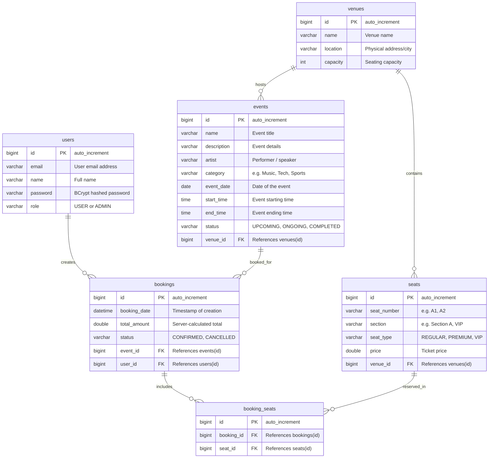

# EVENTRA — Database Schema & Data Dictionary

This document details the actual relational MySQL database schema utilized by the EVENTRA backend.

---

## Database Overview
- **Database Name**: `eventra`
- **Engine**: `InnoDB`
- **Default Charset**: `utf8mb4`
- **Collation**: `utf8mb4_0900_ai_ci`
- **Total Tables**: 6 (`users`, `venues`, `events`, `seats`, `bookings`, `booking_seats`)

---

## Table of Contents
1. [Schema Diagram (Entity-Relationship)](#1-schema-diagram)
2. [Table Specifications](#2-table-specifications)
   - [users](#21-users)
   - [venues](#22-venues)
   - [events](#23-events)
   - [seats](#24-seats)
   - [bookings](#25-bookings)
   - [booking_seats](#26-booking_seats)
3. [Foreign Keys & Indexes](#3-foreign-keys--indexes)
4. [Relational Integrity & Safeguards](#4-relational-integrity--safeguards)

---

## 1. Schema Diagram



---

## 2. Table Specifications

### 2.1 `users`
Stores user profile credentials, access roles, and authentication details.

| Column | Data Type | Nullable | Key | Default | Description |
|---|---|---|---|---|---|
| `id` | `BIGINT` | `NO` | `PRI` | `auto_increment` | Primary key |
| `name` | `VARCHAR(255)` | `YES` | | `NULL` | Full name of the user |
| `email` | `VARCHAR(255)` | `YES` | | `NULL` | Login email (unique in business logic) |
| `password` | `VARCHAR(255)` | `YES` | | `NULL` | BCrypt hashed password |
| `role` | `VARCHAR(255)` | `YES` | | `NULL` | Access role: `USER` or `ADMIN` |

---

### 2.2 `venues`
Stores physical locations and stadiums hosting events.

| Column | Data Type | Nullable | Key | Default | Description |
|---|---|---|---|---|---|
| `id` | `BIGINT` | `NO` | `PRI` | `auto_increment` | Primary key |
| `name` | `VARCHAR(255)` | `YES` | | `NULL` | Venue name |
| `location` | `VARCHAR(255)` | `YES` | | `NULL` | Address, city, or district |
| `capacity` | `INT` | `YES` | | `NULL` | Total seating / attendee capacity |

---

### 2.3 `events`
Stores organized events scheduled at specific venues.

| Column | Data Type | Nullable | Key | Default | Description |
|---|---|---|---|---|---|
| `id` | `BIGINT` | `NO` | `PRI` | `auto_increment` | Primary key |
| `name` | `VARCHAR(255)` | `YES` | | `NULL` | Title of the event |
| `description` | `VARCHAR(255)` | `YES` | | `NULL` | Event overview |
| `artist` | `VARCHAR(255)` | `YES` | | `NULL` | Performing artist / speaker |
| `category` | `VARCHAR(255)` | `YES` | | `NULL` | Category (e.g., Music, Conference) |
| `event_date` | `DATE` | `YES` | | `NULL` | Date of the event |
| `start_time` | `TIME` | `YES` | | `NULL` | Starting time |
| `end_time` | `TIME` | `YES` | | `NULL` | Ending time |
| `status` | `VARCHAR(255)` | `YES` | | `NULL` | Status (e.g., `UPCOMING`) |
| `venue_id` | `BIGINT` | `YES` | `MUL` | `NULL` | Foreign key referencing `venues(id)` |

---

### 2.4 `seats`
Represents physical or tier-based seats attached to a specific venue.

| Column | Data Type | Nullable | Key | Default | Description |
|---|---|---|---|---|---|
| `id` | `BIGINT` | `NO` | `PRI` | `auto_increment` | Primary key |
| `seat_number` | `VARCHAR(255)` | `YES` | | `NULL` | Seat identifier (e.g. `A1`, `B12`) |
| `section` | `VARCHAR(255)` | `YES` | | `NULL` | Hall/ground section |
| `seat_type` | `VARCHAR(255)` | `YES` | | `NULL` | Type (`REGULAR`, `PREMIUM`, `VIP`) |
| `price` | `DOUBLE` | `YES` | | `NULL` | Base price per seat |
| `venue_id` | `BIGINT` | `YES` | `MUL` | `NULL` | Foreign key referencing `venues(id)` |

---

### 2.5 `bookings`
Represents reservation orders placed by users for specific events.

| Column | Data Type | Nullable | Key | Default | Description |
|---|---|---|---|---|---|
| `id` | `BIGINT` | `NO` | `PRI` | `auto_increment` | Primary key |
| `booking_date` | `DATETIME(6)` | `YES` | | `NULL` | Timestamp when booking was created |
| `status` | `VARCHAR(255)` | `YES` | | `NULL` | Booking state (`CONFIRMED`, `CANCELLED`)|
| `total_amount` | `DOUBLE` | `YES` | | `NULL` | Total price calculated server-side |
| `event_id` | `BIGINT` | `YES` | `MUL` | `NULL` | Foreign key referencing `events(id)` |
| `user_id` | `BIGINT` | `YES` | `MUL` | `NULL` | Foreign key referencing `users(id)` |

---

### 2.6 `booking_seats`
Join table linking confirmed bookings with the specific reserved seats.

| Column | Data Type | Nullable | Key | Default | Description |
|---|---|---|---|---|---|
| `id` | `BIGINT` | `NO` | `PRI` | `auto_increment` | Primary key |
| `booking_id` | `BIGINT` | `YES` | `MUL` | `NULL` | Foreign key referencing `bookings(id)` |
| `seat_id` | `BIGINT` | `YES` | `MUL` | `NULL` | Foreign key referencing `seats(id)` |

---

## 3. Foreign Keys & Indexes

The following foreign keys and indexing constraints are actively enforced in MySQL:

| Table | Constraint Name | Column | Target Table & Column |
|---|---|---|---|
| `events` | `FKqdxygdernwwt74hdvix9u5nr3` | `venue_id` | `venues(id)` |
| `seats` | `FKfahhtb0bb0u1wcnqqys0iehmo` | `venue_id` | `venues(id)` |
| `bookings` | `FK2ww82bk3npaiyu9oeehwtt2q3` | `event_id` | `events(id)` |
| `bookings` | `FKeyog2oic85xg7hsu2je2lx3s6` | `user_id` | `users(id)` |
| `booking_seats` | `FKmbi9ciapn0nvat63t0a8tv478` | `booking_id` | `bookings(id)` |
| `booking_seats` | `FKm2vak166qv8osqwe5qcxsn1p` | `seat_id` | `seats(id)` |

---

## 4. Relational Integrity & Safeguards

To prevent cascading anomalies or orphaned database records, the application service layer validates constraints before executing deletions:

1. **Venues**:
   Cannot be deleted if associated with any event:
   ```sql
   SELECT COUNT(*) FROM events WHERE venue_id = :venueId;
   ```
2. **Events**:
   Cannot be deleted if associated with any booking:
   ```sql
   SELECT COUNT(*) FROM bookings WHERE event_id = :eventId;
   ```
3. **Seats**:
   Cannot be deleted if referenced in `booking_seats`:
   ```sql
   SELECT COUNT(*) FROM booking_seats WHERE seat_id = :seatId;
   ```
4. **Users**:
   Cannot be deleted if user has placed bookings:
   ```sql
   SELECT COUNT(*) FROM bookings WHERE user_id = :userId;
   ```
5. **Double-Booking Logic**:
   A seat is marked unavailable if a record in `booking_seats` belongs to a booking for the event with `status = 'CONFIRMED'`:
   ```sql
   SELECT COUNT(*) FROM booking_seats bs 
   JOIN bookings b ON bs.booking_id = b.id 
   WHERE bs.seat_id = :seatId AND b.event_id = :eventId AND b.status = 'CONFIRMED';
   ```

