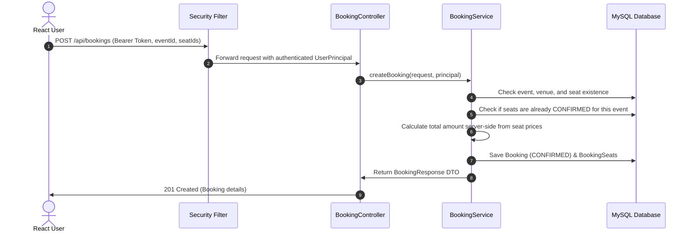

# EVENTRA — Event Booking & Management Backend

EVENTRA is a production-style event booking and ticketing backend system built with Java 21 and Spring Boot. It provides a secure, role-based REST API designed for seamless integration with a modern React frontend.

---

## Table of Contents
- [Overview](#overview)
- [Main Features](#main-features)
- [Tech Stack](#tech-stack)
- [Backend Architecture Overview](#backend-architecture-overview)
- [Authentication & Security](#authentication--security)
- [Booking Workflow](#booking-workflow)
- [Project Structure](#project-structure)
- [How to Run the Project](#how-to-run-the-project)
- [Documentation Index](#documentation-index)
- [Frontend Integration Notes](#frontend-integration-notes)

---

## Overview
EVENTRA powers full-lifecycle event discovery, venue management, seat reservations, and booking management. The application features stateless JWT authentication, password hashing using BCrypt, role-based access control (`USER` vs `ADMIN`), strict service-layer ownership validation (IDOR defense), and transactional seat locking to prevent double bookings.

---

## Main Features
1. **User Authentication & Management**:
   - Secure registration with duplicate email validation.
   - Forced `USER` role assignment upon public registration (prevents role escalation).
   - BCrypt password hashing (`PasswordEncoder`).
   - Stateless JWT issuance upon login (`POST /api/auth/login`).
   - Profile retrieval and update with self-ownership enforcement.
   - Dedicated password change endpoint (`PUT /api/users/{id}/password`).
   - Safeguards preventing deletion of users who have existing booking history.

2. **Event & Venue Management**:
   - Public event and venue browsing for attendees.
   - Administrative CRUD operations for venues and events (`ADMIN` role required).
   - Validation ensuring events are linked to existing venues.
   - Safeguards preventing deletion of venues assigned to active events.
   - Safeguards preventing deletion of events that have booking history.

3. **Seat Management**:
   - Seat assignment per venue with category (`REGULAR`, `PREMIUM`), section, and price.
   - Administrative seat creation, update, and deletion.
   - Safeguards preventing deletion of seats referenced in booking history.

4. **Booking Lifecycle**:
   - Authoritative user identity binding via JWT (client `userId` cannot impersonate other users).
   - Verification that seats belong to the event venue.
   - Prevention of double bookings for confirmed seats.
   - Server-side calculation of `totalAmount` based on database seat pricing.
   - Booking history retrieval strictly scoped to the authenticated owner (or `ADMIN`).
   - Non-destructive booking cancellation (`PUT /api/bookings/{id}/cancel`), marking status as `CANCELLED` and immediately releasing seats for rebooking while preserving audit history.

5. **Cross-Origin Resource Sharing (CORS)**:
   - Configured for React single-page applications running at `http://localhost:5173`, `http://localhost:3000`, and `http://127.0.0.1:5173`.

---

## Tech Stack
- **Language**: Java 21
- **Framework**: Spring Boot 4.1.1
- **Security**: Spring Security 7.1.1, BCrypt Password Encoder
- **Authentication**: JSON Web Tokens (JJWT 0.12.6)
- **Data Persistence**: Spring Data JPA, Hibernate ORM 7.4.5
- **Database**: MySQL 8.0 (Database name: `eventra`)
- **Validation**: Jakarta Validation (`hibernate-validator`)
- **Build Tool**: Apache Maven (via Maven Wrapper `mvnw`)
- **Default Port**: `4040`

---

## Backend Architecture Overview
EVENTRA follows a strict layered architecture:
```
HTTP Request
     │
     ▼
[JwtAuthenticationFilter]  ──► (Validates JWT Bearer Token & populates SecurityContext)
     │
     ▼
[Controllers]              ──► (Route handling, HTTP status codes, @Valid request validation)
     │
     ▼
[Services]                 ──► (Business logic, transactional boundaries, service-layer ownership checks)
     │
     ▼
[Repositories]             ──► (Spring Data JPA interfaces executing queries on MySQL)
     │
     ▼
[MySQL Database]           ──► (Normalized tables with foreign key constraints)
```

---

## Authentication & Security
- **Stateless Sessions**: Managed using `SessionCreationPolicy.STATELESS`.
- **Token Passing**: Sent via HTTP header: `Authorization: Bearer <JWT_TOKEN>`.
- **Public Routes**:
  - `POST /api/auth/login`
  - `POST /api/users` (Registration)
  - `GET /api/events/**`
  - `GET /api/venues/**`
  - `GET /api/seats/**`
  - `GET /api/bookings/seat-check`
- **User Routes**: Profile viewing/editing, password change, booking creation, viewing own bookings, cancelling own bookings.
- **Admin Routes**: All modification endpoints for events, venues, seats, user listing, and all-bookings listing.

---

## Booking Workflow


---

## Project Structure
```
backend/
├── pom.xml                                   # Maven dependencies and build settings
├── mvnw / mvnw.cmd                           # Maven wrapper scripts
├── src/
│   ├── main/
│   │   ├── java/com/eventra/
│   │   │   ├── BackendApplication.java       # Main Spring Boot entry point
│   │   │   ├── config/
│   │   │   │   └── SecurityConfig.java       # Spring Security, CORS, and route filters
│   │   │   ├── controller/
│   │   │   │   ├── AuthController.java       # Login endpoint
│   │   │   │   ├── BookingController.java    # Booking creation, history, cancellation
│   │   │   │   ├── BookingSeatController.java# Booking-seat associations
│   │   │   │   ├── EventController.java      # Event CRUD endpoints
│   │   │   │   ├── SeatController.java       # Seat CRUD endpoints
│   │   │   │   ├── UserController.java       # User registration, profile, password change
│   │   │   │   └── VenueController.java      # Venue CRUD endpoints
│   │   │   ├── dto/
│   │   │   │   ├── BookingRequest.java       # Booking input payload
│   │   │   │   ├── BookingResponse.java      # Structured booking response payload
│   │   │   │   ├── ErrorResponse.java        # Structured JSON error response
│   │   │   │   ├── LoginRequest.java         # Email/password login credentials
│   │   │   │   ├── LoginResponse.java        # JWT token and user profile response
│   │   │   │   ├── PasswordChangeRequest.java# Password update payload
│   │   │   │   └── UserResponse.java         # Safe user profile DTO (no password)
│   │   │   ├── entity/
│   │   │   │   ├── Booking.java              # Bookings table entity
│   │   │   │   ├── BookingSeat.java          # Booking_seats join table entity
│   │   │   │   ├── Event.java                # Events table entity
│   │   │   │   ├── Seat.java                 # Seats table entity
│   │   │   │   ├── User.java                 # Users table entity
│   │   │   │   └── Venue.java                # Venues table entity
│   │   │   ├── exception/
│   │   │   │   ├── EmailAlreadyExistsException.java
│   │   │   │   └── GlobalExceptionHandler.java # REST exception advice (400, 401, 403, 404, 409, 500)
│   │   │   ├── repository/
│   │   │   │   ├── BookingRepository.java
│   │   │   │   ├── BookingSeatRepository.java
│   │   │   │   ├── EventRepository.java
│   │   │   │   ├── SeatRepository.java
│   │   │   │   ├── UserRepository.java
│   │   │   │   └── VenueRepository.java
│   │   │   ├── security/
│   │   │   │   ├── CustomAccessDeniedHandler.java
│   │   │   │   ├── CustomAuthenticationEntryPoint.java
│   │   │   │   ├── CustomUserDetailsService.java
│   │   │   │   ├── JwtAuthenticationFilter.java
│   │   │   │   ├── JwtService.java
│   │   │   │   └── UserPrincipal.java
│   │   │   └── service/
│   │   │       ├── AuthService.java
│   │   │       ├── BookingSeatService.java
│   │   │       ├── BookingService.java
│   │   │       ├── EventService.java
│   │   │       ├── SeatService.java
│   │   │       ├── UserService.java
│   │   │       └── VenueService.java
│   │   └── resources/
│   │       └── application.properties        # Application configuration
│   └── test/
│       └── java/com/eventra/
│           └── BackendApplicationTests.java  # Automated unit and integration tests
├── API_DOCUMENTATION.md                      # Detailed API reference for all endpoints
├── BACKEND_ARCHITECTURE.md                   # Architectural flows and security deep-dive
├── DATABASE_SCHEMA.md                        # Full MySQL table specifications and ER model
└── SETUP_GUIDE.md                            # Environment configuration and run instructions
```

---

## How to Run the Project
1. **Prerequisites**:
   - Java 21 JDK installed.
   - MySQL 8.0 running locally on port 3306 with database `eventra`.
2. **Build and Test**:
   ```powershell
   .\mvnw.cmd clean test
   ```
3. **Run Application**:
   ```powershell
   .\mvnw.cmd spring-boot:run
   ```
   The backend starts at `http://localhost:4040`.

---

## Documentation Index
- [API_DOCUMENTATION.md](file:///c:/Users/G%20harsha%20vardhan/TT-2/Eventra/backend/API_DOCUMENTATION.md) — Complete endpoint reference, payload samples, and error codes.
- [BACKEND_ARCHITECTURE.md](file:///c:/Users/G%20harsha%20vardhan/TT-2/Eventra/backend/BACKEND_ARCHITECTURE.md) — Architecture diagrams, security filters, and data flows.
- [DATABASE_SCHEMA.md](file:///c:/Users/G%20harsha%20vardhan/TT-2/Eventra/backend/DATABASE_SCHEMA.md) — Table schemas, foreign keys, and indexes.
- [SETUP_GUIDE.md](file:///c:/Users/G%20harsha%20vardhan/TT-2/Eventra/backend/SETUP_GUIDE.md) — Environment variables, local setup, and troubleshooting.

---

## Frontend Integration Notes
- **API Base URL**: `http://localhost:4040`
- **CORS Allowed Origins**: `http://localhost:5173` (Vite / React default), `http://localhost:3000` (Create React App), `http://127.0.0.1:5173`.
- **JWT Storage**: Store the token returned by `POST /api/auth/login` in `localStorage` or `sessionStorage` and include it on authenticated requests:
  ```javascript
  headers: {
    'Authorization': `Bearer ${token}`,
    'Content-Type': 'application/json'
  }
  ```

